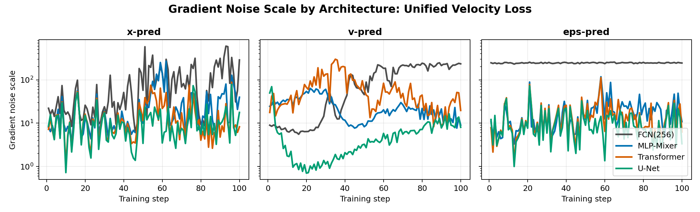
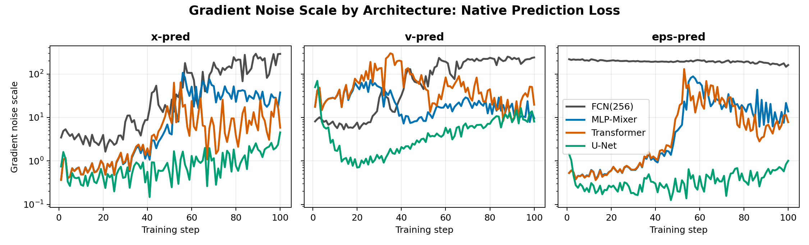
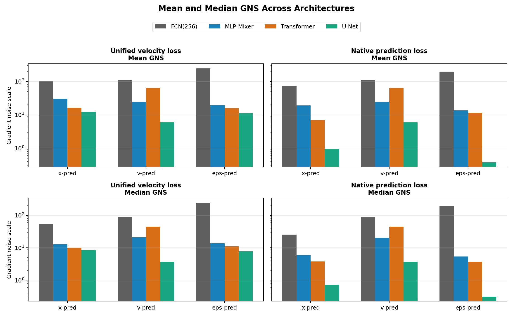
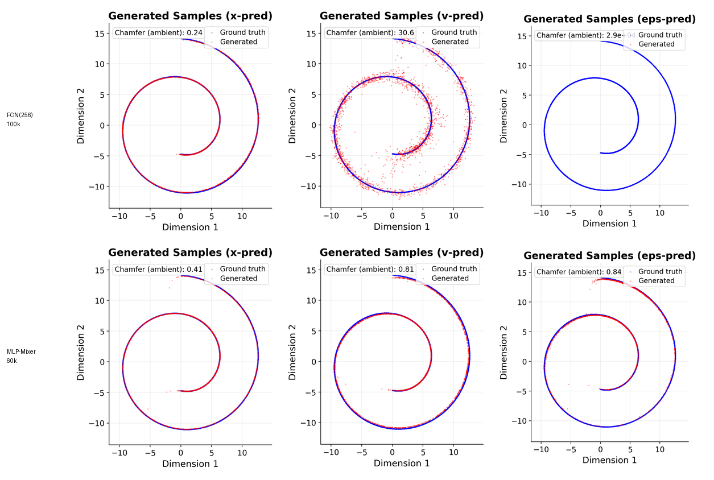
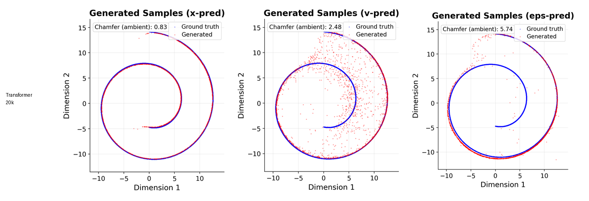

# Gradient Noise Scale Across Architectures

This note summarizes the gradient-noise-scale (GNS) diagnostic on the toy high-dimensional diffusion/flow-matching experiment. The main question is whether different architectures produce different early-training gradient noise when trained on the same low-dimensional data embedded in a high-dimensional ambient space.

The short version is: **FCN(256) has much larger gradient noise scale than the patch/token/local architectures.** This is most dramatic for epsilon prediction. The effect is visible under the unified velocity loss and remains visible, though partly reduced, under native prediction losses.

## What We Measure

For a mini-batch of size $B$, let the per-sample loss be $\ell_i(\theta)$ and the per-sample gradient be

$$
g_i = \nabla_\theta \ell_i(\theta).
$$

The batch mean gradient is

$$
\bar g = \frac{1}{B}\sum_{i=1}^{B} g_i.
$$

We define gradient noise scale as

$$
\mathrm{GNS} = \frac{\mathrm{Tr}(\mathrm{Cov}[g_i])}{\|\bar g\|_2^2}.
$$

The empirical covariance trace is estimated by

$$
\mathrm{Tr}(\mathrm{Cov}[g_i])
= \frac{B}{B-1}\left(\frac{1}{B}\sum_{i=1}^{B}\|g_i\|_2^2 - \|\bar g\|_2^2\right).
$$

Interpretation:

- Low GNS means per-sample gradients are aligned, so the batch mean is a strong optimization signal.
- High GNS means per-sample gradients point in conflicting directions, so the batch mean is weak relative to sample-level variation.
- When GNS is comparable to the batch size, the optimizer is effectively averaging many poorly aligned sample gradients.

## Experimental Setup

The data are generated by embedding a low-dimensional clean signal $x_0$ into an ambient space of dimension $D=512$. At each training step, we sample

$$
t = \sigma(\xi), \qquad \xi \sim \mathcal{N}(0,1),
$$

and construct the noisy interpolation

$$
z_t = (1-t)x_0 + t\epsilon, \qquad \epsilon \sim \mathcal{N}(0,I).
$$

The velocity target is

$$
v_\star = \epsilon - x_0.
$$

The GNS diagnostic uses:

- batch size $B=256$;
- first 100 optimizer steps;
- AdamW with learning rate $10^{-4}$, weight decay 0, gradient clipping norm 1.0;
- identical data distribution and time sampling across architectures;
- zero-initialized final output layer.

## Architectures

| Model | Architecture | Parameters | GNS estimator |
| --- | --- | --- | --- |
| FCN(256) | 5-layer AdaLN-zero residual MLP, width 256 | 2,039,296 | exact for velocity-loss run; microbatch for native-loss run |
| MLP-Mixer | patch size 8, dim 128, depth 5, token MLP 128, channel MLP 512 | 1,936,072 | exact for velocity-loss run; microbatch for native-loss run |
| Transformer | patch size 8, dim 128, depth 5, 1 attention head, MLP width 512 | 2,183,432 | microbatch |
| U-Net | 1D Tiny U-Net + AdaGN, patch size 4, stride 2, base channels 56 | 1,979,196 | microbatch |

## Loss Objectives

We tested two ways to define the loss.

### Unified Velocity Loss

All prediction heads are converted into velocity before computing MSE against $v_\star$:

$$
\mathcal{L} = \|v_\theta(z_t,t) - (\epsilon-x_0)\|_2^2.
$$

For the three parameterizations:

$$
\begin{aligned}
\text{x-pred:} \quad & v_\theta = \frac{z_t - \hat x_\theta}{t}, \\
\text{v-pred:} \quad & v_\theta = \hat v_\theta, \\
\text{eps-pred:} \quad & v_\theta = \frac{\hat\epsilon_\theta - z_t}{1-t}.
\end{aligned}
$$

This asks: if all objectives are evaluated in velocity space, how noisy are the early gradients induced by each prediction parameterization?

### Native Prediction Loss

Each head is trained against its natural target:

$$
\begin{aligned}
\text{x-pred:} \quad & \mathcal{L} = \|\hat x_\theta - x_0\|_2^2, \\
\text{v-pred:} \quad & \mathcal{L} = \|\hat v_\theta - (\epsilon-x_0)\|_2^2, \\
\text{eps-pred:} \quad & \mathcal{L} = \|\hat\epsilon_\theta - \epsilon\|_2^2.
\end{aligned}
$$

This asks whether high GNS is merely an artifact of velocity-space reweighting, or whether it remains under the native target.

## How GNS Was Computed

For FCN(256) and MLP-Mixer under the unified velocity loss, we used exact per-sample gradients with `torch.func.vmap(grad)`. The implementation streams chunks of per-sample gradients and immediately reduces them into

$$
\sum_i g_i, \qquad \sum_i \|g_i\|_2^2,
$$

so it never saves a full per-sample gradient matrix.

For heavier architecture comparisons, we used a microbatch estimator. If a full batch is split into microbatches of size $m$, and $G_j$ is the average gradient in microbatch $j$, then approximately

$$
\mathrm{Cov}[G_j] \approx \frac{1}{m}\mathrm{Cov}[g_i].
$$

Therefore we estimate

$$
\mathrm{Tr}(\mathrm{Cov}[g_i]) \approx m\,\mathrm{Tr}(\mathrm{Cov}[G_j]).
$$

The native-loss architecture comparison used $m=32$.

## Result 1: Unified Velocity Loss

### Mean GNS Over the First 100 Steps

| Model | x-pred | v-pred | eps-pred |
| --- | --- | --- | --- |
| FCN(256) | 100.60 | 108.33 | 245.41 |
| MLP-Mixer | 30.09 | 24.62 | 19.27 |
| Transformer | 16.13 | 64.57 | 15.56 |
| U-Net | 12.28 | 6.02 | 11.00 |

### Median GNS Over the First 100 Steps

| Model | x-pred | v-pred | eps-pred |
| --- | --- | --- | --- |
| FCN(256) | 53.95 | 91.29 | 245.17 |
| MLP-Mixer | 12.98 | 21.17 | 13.64 |
| Transformer | 9.93 | 44.52 | 11.15 |
| U-Net | 8.62 | 3.74 | 7.81 |

The most important entry is epsilon prediction. Under the unified velocity loss, FCN(256) has mean epsilon GNS 245.41 and median epsilon GNS 245.17. MLP-Mixer, Transformer, and U-Net all stay far lower.

## Result 2: Native Prediction Loss

### Mean GNS Over the First 100 Steps

| Model | x-pred | v-pred | eps-pred |
| --- | --- | --- | --- |
| FCN(256) | 72.84 | 108.08 | 193.93 |
| MLP-Mixer | 19.13 | 24.48 | 13.47 |
| Transformer | 6.98 | 64.57 | 11.41 |
| U-Net | 0.95 | 6.02 | 0.38 |

### Median GNS Over the First 100 Steps

| Model | x-pred | v-pred | eps-pred |
| --- | --- | --- | --- |
| FCN(256) | 25.68 | 88.52 | 194.50 |
| MLP-Mixer | 5.98 | 20.06 | 5.43 |
| Transformer | 3.79 | 44.52 | 3.68 |
| U-Net | 0.73 | 3.74 | 0.31 |

Native losses reduce some of the velocity-reweighting artifacts. For example, MLP-Mixer and Transformer native epsilon prediction become much less noisy. However, FCN(256) native epsilon prediction remains high, with mean GNS 193.93 and median GNS 194.50.

## Mean and Median Summary

The bar plot emphasizes two points:

- FCN(256) has the largest GNS in nearly every setting.
- U-Net has extremely low native-loss GNS for both x-pred and eps-pred, suggesting that local structure can make per-sample gradients highly aligned.

## Sampling Quality and Its Relation to GNS

The GNS diagnostic is an early-training quantity. To connect it to final behavior, we compare it with generated samples from the longer sampling runs.

### Sampling Metrics

The table below uses ambient-space Chamfer distance, plus sample stable rank and 95% spectral rank. Lower Chamfer is better. A sample rank close to 2 is consistent with recovering the low-dimensional data manifold.

| Model | Training | Prediction | chamfer | precision | recall | stable_rank | rank95 |
| --- | --- | --- | --- | --- | --- | --- | --- |
| FCN(256) | 100k | x-pred | 0.24 | 0.759 | 0.756 | 1.85 | 2 |
| FCN(256) | 100k | v-pred | 30.6 | 0 | 0 | 2.79 | 193 |
| FCN(256) | 100k | eps-pred | 2.93e+04 | 0 | 0 | 140 | 232 |
| MLP-Mixer | 60k | x-pred | 0.413 | 0.426 | 0.36 | 1.89 | 2 |
| MLP-Mixer | 60k | v-pred | 0.81 | 0 | 0 | 1.82 | 2 |
| MLP-Mixer | 60k | eps-pred | 0.837 | 0 | 0 | 1.66 | 2 |
| Transformer | 20k | x-pred | 0.833 | 0 | 0 | 1.72 | 2 |
| Transformer | 20k | v-pred | 2.48 | 0 | 0 | 1.88 | 2 |
| Transformer | 20k | eps-pred | 5.74 | 0 | 0 | 1.04 | 1 |

### FCN(256) vs MLP-Mixer Final Samples

This panel makes the GNS/sample-quality link visually clear. FCN(256) epsilon prediction has extremely high GNS and its final epsilon samples fail catastrophically in ambient space. MLP-Mixer epsilon prediction has much lower GNS and its generated points stay close to the spiral manifold.

### Transformer Final Samples

Transformer also has much lower GNS than FCN(256), and its samples are qualitatively much closer to the target manifold than FCN epsilon samples. However, the Transformer epsilon samples still show a subspace issue in this run: the sample stable rank is close to 1 and one principal direction is lost.

## Interpretation

### 1. Dense FCN gradients are poorly aligned for high-dimensional noise targets

The FCN(256) epsilon result is the clearest signature. Under unified velocity loss, its mean and median GNS are both near 245 for batch size 256. This means per-sample gradients are almost as noisy as one would expect from a high-variance finite batch.

This supports the idea that the FCN is not merely lacking enough parameters. It has roughly the same parameter count as MLP-Mixer and U-Net, but its per-sample gradients are much less coherent.

### 2. Patch/token/local structure reduces GNS

MLP-Mixer, Transformer, and U-Net all substantially reduce GNS relative to FCN(256). This suggests that architectural structure changes the geometry of early gradients. Patchification and local/token mixing appear to turn high-dimensional targets into more coherent update directions.

### 3. The loss objective matters, but does not explain everything

Switching to native prediction loss lowers GNS for x-pred and eps-pred in several models. This confirms that velocity-space conversion factors such as $1/t$ and $1/(1-t)$ can amplify gradient noise.

But the FCN(256) native epsilon GNS remains far above the structured architectures. Therefore the FCN failure is not only a schedule/loss-reweighting artifact.

### 4. GNS is a useful early predictor, not a complete theory

Low GNS correlates with better sample quality in the FCN-vs-Mixer comparison. However, GNS alone does not capture every failure mode. For example, Transformer epsilon prediction has relatively low GNS but still loses one data subspace direction in the final samples. This means GNS should be read as an early optimization-signal diagnostic, not as a complete sampling-quality metric.

## Provisional Conclusion

The architecture comparison supports the following working hypothesis:

> Prediction targets interact with architecture through early gradient geometry. Dense FCNs produce poorly aligned per-sample gradients for high-dimensional noise targets, while patch/token/local architectures create more coherent gradient signals.

This gives a more precise mechanism than simply saying "noise is high-dimensional." The high-dimensional target becomes difficult because, for the FCN, it induces high gradient noise scale and weak mean updates. Structured architectures reduce this noise and therefore make noise or epsilon prediction much more trainable.
