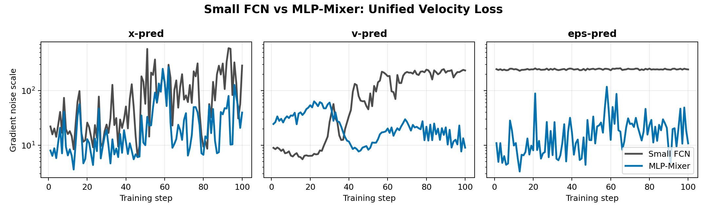
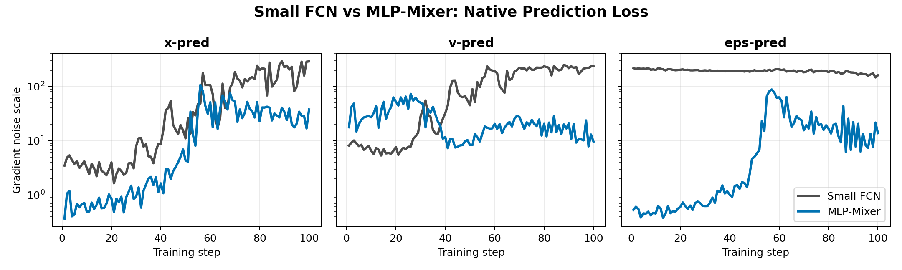
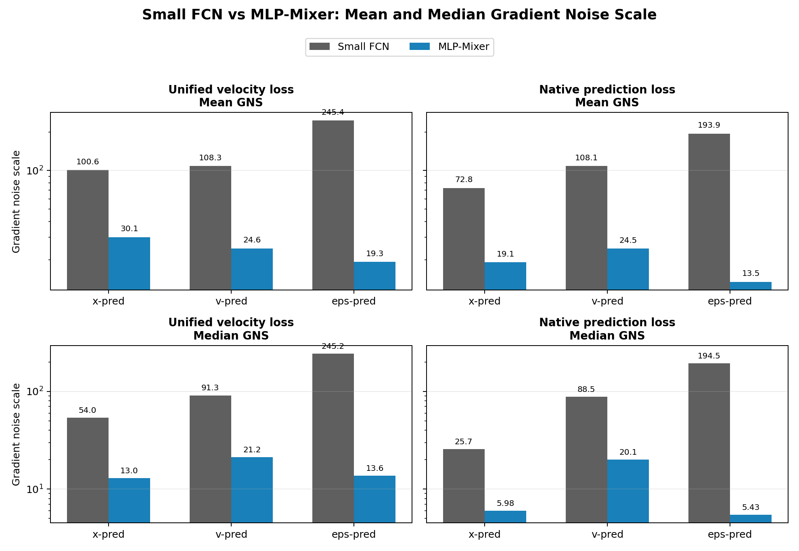
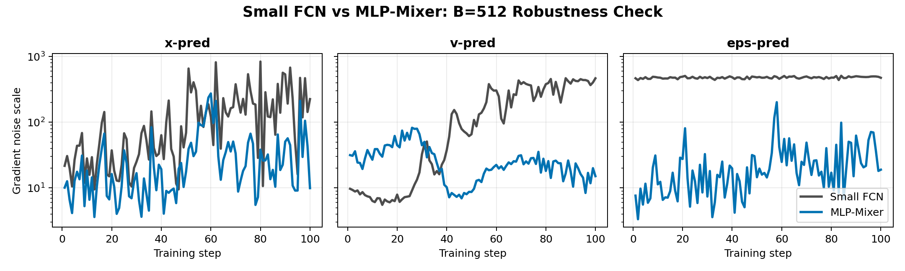

# Gradient Noise Scale: Small FCN vs MLP-Mixer

This note summarizes the gradient-noise-scale diagnostic we ran on the toy diffusion/flow-matching task. The goal is to compare a small fully-connected network (FCN) against a patch-based MLP-Mixer under the same data, optimizer, and early-training protocol.

## Short Takeaway

The small FCN has much larger gradient noise scale than the MLP-Mixer, especially for epsilon prediction. Under the unified velocity loss, FCN epsilon prediction has mean GNS `245.41`, while the Mixer has mean GNS `19.27`. This is a `12.73x` gap in the average and a `17.98x` gap in the median.

When we switch from the unified velocity loss to each prediction type's native loss, the gap shrinks for some objectives but does not disappear. In particular, native epsilon prediction still has FCN mean GNS `193.93` versus Mixer mean GNS `13.47`.

## Experimental Setup

- Data: a low-dimensional Swiss-roll-like clean signal embedded in ambient dimension `D=512`.
- Batch size: `B=256` for the main comparison.
- Training window: first `100` optimization steps.
- Optimizer: AdamW with learning rate `1e-4`, weight decay `0`, gradient clipping norm `1.0`.
- Time sampling: `t = sigmoid(N(0, 1))`, also called sigmoid-normal or logit-normal time sampling.
- No per-sample gradient tensors are saved. The diagnostic accumulates only reduced scalar statistics.

### Models

| Model | Architecture | Parameter count | Notes |
|---|---:|---:|---|
| Small FCN | 5-layer AdaLN-zero residual MLP, width 256 | 2,039,296 | Dense global mixing in ambient coordinates |
| MLP-Mixer | Patch size 8, dim 128, depth 5, token MLP 128, channel MLP 512 | 1,936,072 | Patch/token architecture with structured local-to-token representation |

The parameter counts are intentionally close, so the comparison is not simply "large model vs small model."

## Prediction and Loss Objectives

We considered three prediction heads:

- `x-pred`: the network output is interpreted as a clean-data prediction.
- `v-pred`: the network output is interpreted as velocity.
- `eps-pred`: the network output is interpreted as noise.

The diffusion interpolation is

```text
z_t = (1 - t) x0 + t eps,
v_target = eps - x0.
```

### Unified Velocity Loss

In the original diagnostic, all prediction modes were trained under the same velocity objective. The raw network output is converted into velocity before computing the loss:

```text
x-pred:   v_pred = (z_t - x_pred) / t
v-pred:   v_pred = raw_output
eps-pred: v_pred = (eps_pred - z_t) / (1 - t)
loss:     MSE(v_pred, eps - x0)
```

This isolates differences caused by the prediction parameterization while keeping the final loss space fixed.

### Native Prediction Loss

We also ran a second diagnostic where each prediction mode uses its own native target:

```text
x-pred:   MSE(raw_output, x0)
v-pred:   MSE(raw_output, eps - x0)
eps-pred: MSE(raw_output, eps)
```

This checks whether the high GNS is caused by the velocity-space reweighting or by the target/model geometry itself.

## Gradient Noise Scale Metric

For a batch of per-sample losses `ell_i(theta)`, define the per-sample gradient

```text
g_i = grad_theta ell_i(theta)
```

and the batch mean gradient

```text
g_bar = (1 / B) sum_i g_i.
```

The gradient noise scale is

```text
GNS = Tr(Cov[g_i]) / ||g_bar||_2^2.
```

The empirical covariance trace is computed as

```text
Tr(Cov[g_i]) = B / (B - 1) * ( mean_i ||g_i||_2^2 - ||g_bar||_2^2 ).
```

Interpretation:

- Low GNS means per-sample gradients are aligned and the batch mean is a strong signal.
- High GNS means per-sample gradients disagree and the batch mean is weak relative to sample-level variation.
- For random or poorly aligned gradients, finite-batch GNS can become comparable to the batch size.

## How We Computed or Estimated It

### Exact Per-Sample Estimator

For the main `B=256` FCN-vs-Mixer unified-velocity run, we used exact per-sample gradients with `torch.func.vmap(grad)`. The implementation streams chunks of per-sample gradients and immediately reduces them into

```text
sum_i g_i
sum_i ||g_i||_2^2
```

so the full per-sample gradient matrix is not stored.

### Microbatch Estimator

For heavier runs and robustness checks, we used a microbatch estimator. A batch of size `B` is split into `K` microbatches of size `m`. Let `G_j` be the average gradient of microbatch `j`. Since

```text
Cov[G_j] ~ Cov[g_i] / m,
```

we estimate

```text
Tr(Cov[g_i]) ~ m * Tr(Cov[G_j]).
```

This gives a cheaper estimate of sample-level GNS. The native-loss run reported below uses this estimator with `B=256` and `m=32`.

## Main Result: Unified Velocity Loss

| Model | Prediction | Mean GNS | Median GNS | Min | Max |
| --- | --- | --- | --- | --- | --- |
| Small FCN | x-pred | 100.60 | 53.95 | 6.10 | 597.82 |
| Small FCN | v-pred | 108.33 | 91.29 | 5.55 | 247.05 |
| Small FCN | eps-pred | 245.41 | 245.17 | 230.40 | 256.43 |
| MLP-Mixer | x-pred | 30.09 | 12.98 | 3.61 | 268.86 |
| MLP-Mixer | v-pred | 24.62 | 21.17 | 7.70 | 63.51 |
| MLP-Mixer | eps-pred | 19.27 | 13.64 | 3.31 | 117.66 |

### FCN/Mixer Ratio

| Prediction | Mean ratio FCN/Mixer | Median ratio FCN/Mixer |
| --- | --- | --- |
| x-pred | 3.34x | 4.16x |
| v-pred | 4.40x | 4.31x |
| eps-pred | 12.73x | 17.98x |



## Native Loss Result

| Model | Prediction | Mean GNS | Median GNS | Min | Max |
| --- | --- | --- | --- | --- | --- |
| Small FCN | x-pred | 72.84 | 25.68 | 1.63 | 291.63 |
| Small FCN | v-pred | 108.08 | 88.52 | 5.33 | 250.42 |
| Small FCN | eps-pred | 193.93 | 194.50 | 146.67 | 218.66 |
| MLP-Mixer | x-pred | 19.13 | 5.98 | 0.37 | 106.92 |
| MLP-Mixer | v-pred | 24.48 | 20.06 | 7.26 | 72.90 |
| MLP-Mixer | eps-pred | 13.47 | 5.43 | 0.38 | 88.04 |

### FCN/Mixer Ratio

| Prediction | Mean ratio FCN/Mixer | Median ratio FCN/Mixer |
| --- | --- | --- |
| x-pred | 3.81x | 4.29x |
| v-pred | 4.41x | 4.41x |
| eps-pred | 14.40x | 35.80x |



## Mean and Median Summary Plot



## Batch-Size Robustness Check

We also ran a `B=512` robustness check using the microbatch estimator. The qualitative pattern remains: FCN epsilon prediction stays near the high finite-batch-noise regime, while Mixer stays much lower.

| Model | Prediction | Mean GNS | Median GNS | Min | Max |
| --- | --- | --- | --- | --- | --- |
| Small FCN | x-pred | 147.82 | 77.12 | 9.49 | 838.93 |
| Small FCN | v-pred | 172.20 | 110.79 | 5.52 | 468.29 |
| Small FCN | eps-pred | 479.13 | 480.31 | 438.81 | 509.96 |
| MLP-Mixer | x-pred | 35.31 | 18.54 | 3.61 | 274.23 |
| MLP-Mixer | v-pred | 27.34 | 23.78 | 6.93 | 82.42 |
| MLP-Mixer | eps-pred | 25.25 | 17.86 | 3.33 | 202.14 |



## Interpretation

### 1. FCN epsilon prediction has extremely noisy early gradients

Under unified velocity loss, FCN epsilon prediction has mean GNS `245.41` and median GNS `245.17`. This is close to the finite-batch high-noise regime for `B=256`.

A useful reading is that individual examples push the FCN in many inconsistent directions when the target is high-dimensional noise. The batch mean is therefore weak relative to the sample-level covariance.

### 2. Mixer greatly reduces GNS, especially for epsilon prediction

Under the same unified velocity loss, Mixer epsilon prediction has mean GNS `19.27` and median GNS `13.64`. This suggests that patch/token structure induces much more aligned per-sample gradients.

This is important because the Mixer has a similar parameter count to the FCN. The effect is therefore not well explained by raw parameter count alone.

### 3. Native loss reduces some artifacts but does not erase the architecture gap

The native-loss run removes the velocity-conversion factors `1/t` and `1/(1-t)` for `x` and `eps`. This lowers the GNS for several settings. However, FCN native epsilon prediction still has mean GNS `193.93`, much larger than Mixer native epsilon mean GNS `13.47`.

So the high FCN epsilon GNS is not only a loss-reweighting artifact. The target/model geometry still matters.

### 4. Velocity prediction is not universally the lowest-noise objective

For the FCN, velocity and epsilon both become high-noise later in training. For the Mixer, velocity is moderate, while native epsilon can be quite low. This supports the idea that the apparent advantage of velocity prediction depends on the architecture and the loss parameterization, not only on the abstract target definition.

## Provisional Conclusion

The gradient-noise-scale diagnostic gives a compact explanation for why dense FCNs struggle with noise prediction in this toy high-dimensional diffusion setting. The FCN sees high-dimensional noise targets as highly inconsistent per-sample gradient directions. The Mixer, despite a comparable parameter count, produces much lower GNS, suggesting that patch/token structure creates an implicit bias toward more coherent gradient aggregation.

This does not prove that GNS alone explains sampling quality, but it is a strong early-training signal that separates the dense FCN from the structured Mixer.
